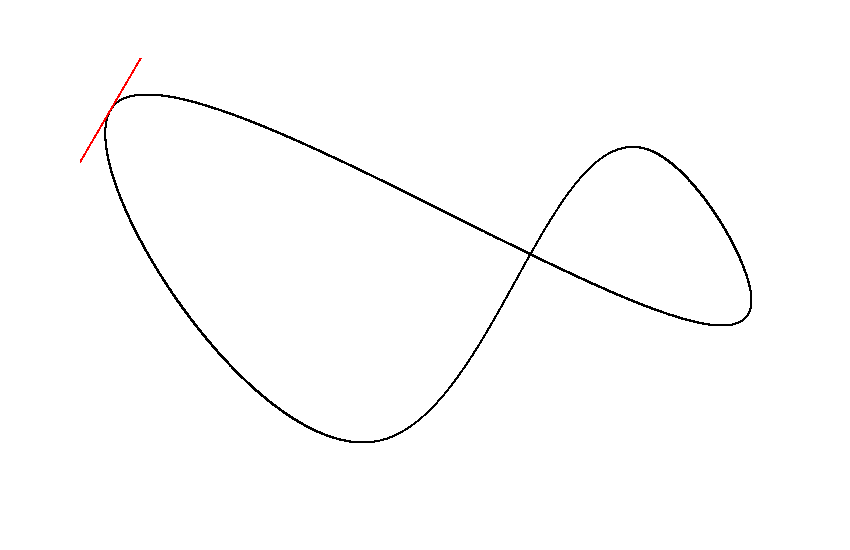

bezier-spline-kotlin
====================

A generic multi-order bezier curve and cubic bezier spline implementation for Java/Kotlin.

[](https://maven-badges.herokuapp.com/maven-central/dev.benedikt.math/bezier-spline)

[](./example)

Installation
------------

```xml
<dependency>
  <groupId>dev.benedikt.math</groupId>
  <artifactId>bezier-spline</artifactId>
  <version>1.1</version>
</dependency>
```

Bezier Spline
-------------

**Note**: Check out the [BezierSpline](https://github.com/Bw2801/bezier-spline-kotlin/wiki/BezierSpline) documentation for further options.

You can create open or closed bezier splines for any amount of dimensions using the provided `FloatBezierSpline`,
`DoubleBezierSpline` and `Vector` implementations. You may also create a custom bezier spline implementation.

```java
BezierSpline<Double, Vector3D> spline = new DoubleBezierSpline<>(true);

spline.addKnots(
        new Vector3D(0.06, 0.06, 0.06),
        new Vector3D(0.7, 0.24, 0.5),
        new Vector3D(0.6, 0.1, 0.35),
        new Vector3D(0.33, 0.39, 0.4)
);

double length = spline.getLength();
Vector3D coordinates = spline.getCoordinatesAt(0.5);
Vector3D tangent = spline.getTangentAt(0.5);
```

The required length estimation happens the first time lengths, coordinates, tangents or control points are queried. You can manually update the spline to move the workload. By default, the performance impact is negligible in most cases.

```java
spline.compute(); // calculations happen here.

// ...

double length = spline.getLength(); // without performance impact
Vector3D coordinates = spline.getCoordinatesAt(0.5);
Vector3D tangent = spline.getTangentAt(0.5);
```


Bezier Curve
------------

```java
BezierCurve<Double, Vector2D> curve = new DoubleBezierCurve(Order.CUBIC, from, to, controlPoints);

double length = curve.getLength();
Vector2D coordinates = curve.getCoordinatesAt(0.5);
Vector2D tangent = curve.getTangentAt(0.5);
```

The required length estimation happens the first time the length is queried. You can manually update the curve to move the workload. By default, the performance impact is negligible in most cases.

```java
curve.computeLength(); // calculations happen here.

// ...

double length = curve.getLength(); // without performance impact
Vector2D coordinates = curve.getCoordinatesAt(0.5);
Vector2D tangent = curve.getTangentAt(0.5);
```
